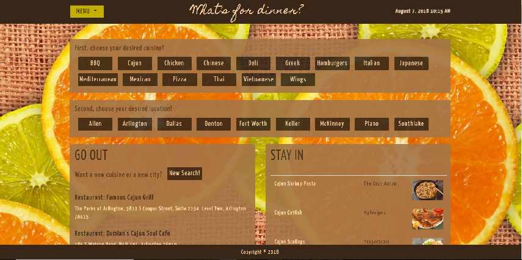

## What's for Dinner, DFW?

At 6 PM each night, a common question around households in DFW is "What's for dinner?" With this new, interactive site, a user in the Dallas Fort Worth area is given the option to "Stay In" and cook with easily, clickable restaurants or "Go Out" to restaurants near them. The website offers a multitude of cuisines or cities from which to choose, as well as a map to easily locate restaurants, if the "Go Out" option is chosen.

# Developers' Toolkit:
html, CSS, JavaScript, jquery, AJAX, Bootstrap, moment.js, google fonts

# API's used:
Yummly, Zomato, Google Maps

# Website Screenshot

Live Link: https://shayshae5482.github.io/group-project/
